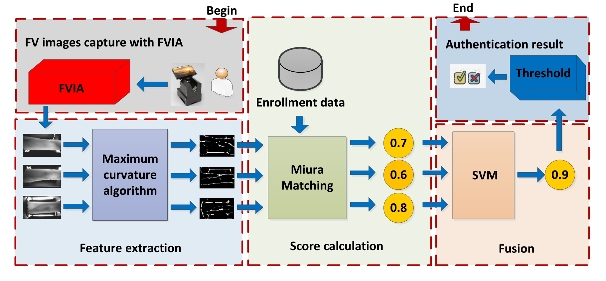
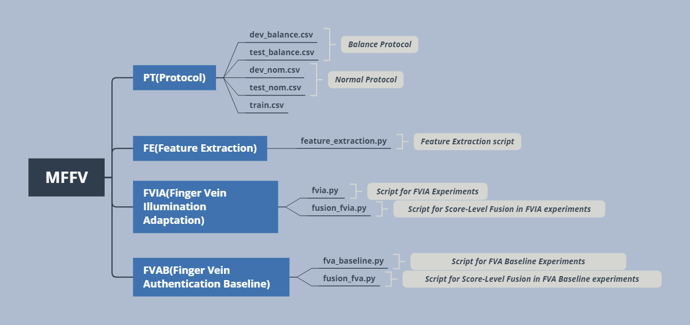

# Usage of MFFV_code

code for reproducing MFFV experiments

## 1. Processing of the experiments



## 2. Structure of the code



## 3. Reproducing The Experimental Results

### Step1: Read the paper, and the structure of the code (above), understand the functions of each script.

In the following commands, the folder bob.paper.tifs.mffv is your local folder where you have cloned this repository.

- activate your conda bob environment.
- The dataset path is: /idiap/resource/database/MFFV-N/data

### Step2: Feature extraction:

Use the following commands for feature extraction

```jsx
cd bob.paper.tifs.mffv/FE
python feature_extraction.py -db /path/of/the/MFFV/dataset/ -fe /path/of/the/feature/you/want/to/save/
```

'feature_extraction.py' can also be run on the SGE-grid. If using grid, it should be distributed over 5760 jobs. 

### Step3: FVIA experiments (Section V-D). Details are as follows:

Use the following commands to run the whole FVIA experiments (Table VII-X). (When the first command finishes you can run the next command.)

```python
cd bob.paper.tifs.mffv/FVIA
python fvia.py -db /path/of/the/MFFV/dataset/ -fe /path/of/the/feature/you/had/saved/ -pt /path/of/the/protocols(PT folder)/ -rs /path/of/the/intermediate-results/you/want/to/save/
```
once the above experiment finish, conduct the score-level fusion experiment:
```python
python fusion_fvia.py -rs /path/of/the/intermediate-results/you/have/saved/ -fs /path/of/the/intermediate-results/you/want/to/save/ # recommendation: set these two paths to be the same
```

'fvia.py' can also be run on the SGE-grid. If using grid, it should be distributed over 81 jobs. 

<!---
The specified output folder (-rs option) will contain the result-files of the various experiments.
- Files starting with 'ths_' are results of the threshold-selection experiments ((Table VII).
- Files starting with 'fxl_' are results of 'fixed-illumination' experiments (Table VIII).
- Files starting with 'inm_' are results of 'individual measures' experiments (Table IX).
- Files starting with 'abl_' are results of 'ablation' experiments (Table X).
--->

- cd to path: /path/of/the/intermediate-results/you/have/save/, then use the following commands for each result-file (example: 'dev_balance_c1_m6_th120.csv') to get the final results/metrics

```jsx
bob bio metrics -d 2 -c min-hter dev_balance_c1_m6_th120.csv
```

### Step4: FVAB experiments (Section V-E). Details are as follows:

Use the following commands to run the whole FVAB experiments (Table XI). (When the first command finishes you can run the next command.)

```jsx
cd bob.paper.tifs.mffv/FVAB
python fvab.py -db -db /path/of/the/MFFV/dataset/ -fe /path/of/the/feature/you/had/saved/ -pt /path/of/the/protocols(PT folder)/ -rs /path/of/the/intermediate-results/you/want/to/save/
```
once the above experiment finish, conduct the score-level fusion experiment:
```python
python fusion_fva.py -rs /path/of/the/intermediate-results/you/have/saved/ -fs /path/of/the/intermediate-results/you/want/to/save/ # recommendation: set these two paths to be the same
```

- cd to path: /path/of/the/intermediate-results/you/have/saved/, then use the following commands for each result-file (example: dev_xxx.csv, and test_xxx.csv ) to get the final results/metrics

```python
bob bio metric -e -d 2 -c eer dev_xxx.csv test_xxx.csv 
bob bio metric -e -d 2 -c min-hter dev_xxx.csv test_xxx.csv 
bob bio metric -e -d 2 -c far -f 0.01 dev_xxx.csv test_xxx.csv 
bob bio metric -e -d 2 -c far -f 0.001 dev_xxx.csv test_xxx.csv 
```

## 4. Dataset

To get the MFFV-N dataset, please sign a license agreement.

## 5. Contact

For further questions/discussions/cooperations, contact Junduan Huang, Email: runrunjun@163.com


